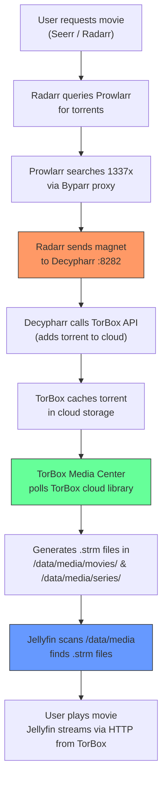

# 🎬 TorBox Media Server (macOS): Architecture, Fixes & Setup Guide

---

## New Architecture: Hybrid Decypharr + TorBox Media Center



### Role Separation

| Container | Role | What It Does |
| :--- | :--- | :--- |
| **Decypharr** | qBittorrent Mock | Receives magnet links from Radarr/Sonarr, pushes them to TorBox API. **Does NOT create .strm files or symlinks.** |
| **TorBox Media Center** | STRM File Generator | Official TorBox client. Polls your TorBox cloud library and generates `.strm` text files inside `/data/media/movies/` and `/data/media/series/`. |
| **Jellyfin** | Media Server | Reads `.strm` files from `/data/media/`, streams video directly from TorBox CDN via HTTP. |

---

## Files Changed

### 1. `docker-compose.macos.yml`
- **Added** `torbox-media-center` service using `anonymoussystems/torbox-media-center:latest`
  - Environment: `MOUNT_METHOD=strm`, `MOUNT_PATH=/torbox`, `MOUNT_REFRESH_TIME=fast`
  - Volume: `${DATA_DIR}/media:/torbox` (TorBox MC writes .strm files here)
  - Depends on Decypharr health check
- **Updated** Decypharr comment to "Torrent-only mode"
- **Updated** Jellyfin to depend on both `decypharr` AND `torbox-media-center`
- **Removed** `${MOUNT_DIR}:/mnt/remote` from Jellyfin volumes (no FUSE mount needed)

### 2. `setup_macos.sh`
- **Removed** `"default_download_action": "strm"` from `generate_decypharr_config()` (Decypharr no longer handles STRM)
- **Updated** banner to show `TorBox Media Center` instead of `STRM files`
- **Added** `torbox-media-center` to `SVC_ORDER`, `get_svc_port()`, `get_svc_label()`, and `print_service_urls()`

### 3. `torbox-media-server/configs/decypharr/config.json`
- **Removed** `"default_download_action": "strm"` from active config

### 4. `setup.sh` (Linux — bonus fix)
- **Fixed** Decypharr download client credentials: was passing `http://radarr:7878` as username and Radarr API key as password. Now uses `${DECYPHARR_USER}` and `${DECYPHARR_PASS}`.

### 5. Caches & Data Cleared
- Cleared `configs/decypharr/cache/`, `configs/decypharr/db/`, `configs/decypharr/logs/`
- Cleared `data/downloads/` and `data/media/`
- Recreated `data/media/movies/`, `data/media/series/`, `data/downloads/radarr/`, `data/downloads/sonarr/`

---

## Prowlarr 1337x Fix

From `configs/prowlarr/logs/prowlarr.txt`:
```
Indexer 1337x has performed 12 of possible 5 queries in last 24 hour(s), exceeding the maximum query limit
```

### Fix in Prowlarr UI (`http://localhost:9696`):
1. **Settings → Indexer Proxies → Byparr**: Add tag `flaresolverr`
2. **Indexers → 1337x → Edit**:
   - **Tags**: Add `flaresolverr`
   - **Base URL**: `https://1337x.to`
   - **Queries Per Day**: Set to `0` (unlimited)
   - **Download Link Type**: `Magnet Url`

---

## How to Start Fresh

```bash
# 1. Stop old containers
cd torbox-media-server
docker compose down --remove-orphans

# 2. Start the new stack with TorBox Media Center
docker compose -f ../docker-compose.macos.yml --env-file .env up -d

# 3. Verify all containers are running
docker ps --format "table {{.Names}}\t{{.Status}}\t{{.Ports}}"
```

### Expected containers:
| Container | Status |
| :--- | :--- |
| `decypharr` | Running (healthy) |
| `prowlarr` | Running (healthy) |
| `byparr` | Running (healthy) |
| `radarr` | Running (healthy) |
| `sonarr` | Running (healthy) |
| `seerr` | Running (healthy) |
| `torbox-media-center` | Running |
| `jellyfin` | Running (healthy) |

---

## Verification Checklist

- [x] `docker-compose.macos.yml` validated with `docker compose config -q`
- [x] `setup_macos.sh` syntax verified with `bash -n`
- [x] `setup.sh` syntax verified with `bash -n`
- [x] All 69 unit tests pass (`bash tests/test_setup_functions.sh`)
- [x] Decypharr caches/db/logs cleared for fresh start
- [x] Old media/download data cleared
- [x] Media directories recreated (`movies/`, `series/`, `downloads/radarr/`, `downloads/sonarr/`)
- [ ] **Manual**: Update 1337x in Prowlarr UI (query limit + flaresolverr tag)
- [ ] **Manual**: Configure Jellyfin library to scan `/data/media/movies` and `/data/media/series`
